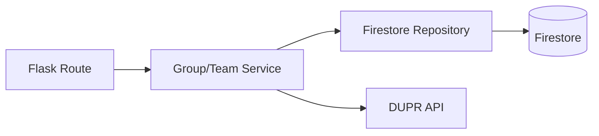

# Architecture Patterns

**Domain:** Sports/Pickleball Ladder App
**Researched:** 2026-04-21

## Recommended Architecture: Repository-Service Pattern

The project should migrate towards a clear separation of concerns between data persistence and business logic.

### Component Boundaries

| Component | Responsibility | Communicates With |
|-----------|---------------|-------------------|
| **Repositories** | CRUD, query filters, Firestore batch management. | Firestore DB |
| **Services** | Business logic (ELO), stat aggregation, data enrichment. | Repositories, External APIs |
| **Blueprints (Routes)** | Request validation, session management, rendering. | Services |

### Data Flow



## Patterns to Follow

### Pattern 1: Deterministic IDs for Junctions
**What:** Use `${userId}_${teamId}` for membership document IDs.
**When:** Creating M:M relationships (Users in Teams, Users in Groups).
**Example:**
```python
# In MembershipRepository
def join_team(user_id, team_id):
    doc_id = f"{user_id}_{team_id}"
    db.collection("memberships").document(doc_id).set({
        "userId": user_id,
        "teamId": team_id,
        "role": "member"
    })
```

### Pattern 2: CamelCase Firestore Fields
**What:** Always use `createdAt`, `updatedAt`, `ownerId`.
**Why:** Consistent with the majority of the current codebase (~80%).

## Anti-Patterns to Avoid

### Anti-Pattern 1: Procedural Service Bloat
**What:** Putting raw Firestore `where()` clauses and `update()` calls inside a Service method alongside business logic.
**Instead:** Move the query to a Repository method.

### Anti-Pattern 2: Divergent Stats Calculation
**What:** Calculating the same metric (e.g. Win %) differently in two places (Real-time vs Cached).
**Instead:** Centralize the calculation logic in a Service or use a Cloud Function to keep cached stats in sync.

## Scalability Considerations

| Concern | At 100 users | At 10K users | At 1M users |
|---------|--------------|--------------|-------------|
| Leaderboards | In-memory sort | Cached in document | Cloud Function / BigQuery |
| Match History | Simple query | Pagination (Cursor) | Sharded collections |
| Stat Aggregation | Real-time | Denormalized fields | Event-driven updates |

## Sources
- Firestore Best Practices (Official)
- Domain Driven Design (DDD) Patterns
